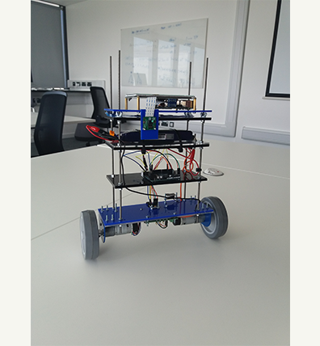
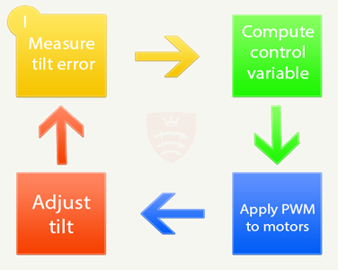
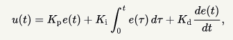
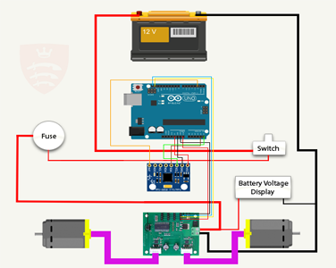
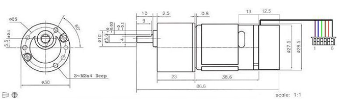
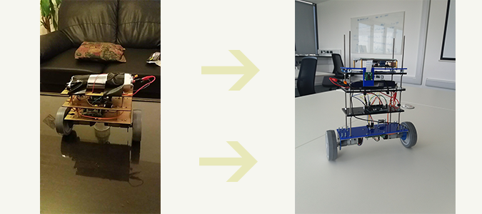

# Two wheeled self-balancing robot "Bingo"

## Introduction to the project...

A quick look at the range of mobile robots in existence reveals an enormous diversity in shape, form, and modes of mobility. However, one thing that most of them have in common is that they are passively balanced (i.e. their bodies are constantly in a state of stable equilibrium). While this is perfectly logical in most cases, there are certain applications, such as Segway’s and humanoid robots, that take advantage of an unstable-equilibrium, inverted pendulum design to enhance their capabilities. While their self-balancing mechanisms may increase the complexity of their design, the benefits, which include greater maneuverability and stability, outweigh the costs.

These systems use the same controllers that can be seen in servo-motors, air-conditioning units, and even thermostats. Of course, rockets use significantly more complex controllers than air-conditioners, but the underlying principle is still the same: how to adjust the system to get as close to the desired outcome as possible. That is why building a self-balancing robot is so educational; you can use the same control methods repeatedly for other projects.

To demonstrate the benefits of such a design, I built an upright, self-balancing, two-wheeled robot utilizing an IMU and a PID feedback control loop to maintain stability. While doing this I hope to get a good knowledge on PID control loops, so I can easily use them in future systems.

# How it was done...

Our self-balancing robot design is essentially an inverted pendulum, which is a pendulum with its center of mass above the pivot point. Balancing an inverted pendulum is a challenge because it is inherently unstable. The slightest disturbance from equilibrium position results in a force away from equilibrium that further destabilizes the system. Therefore, keeping balance at an unstable equilibrium requires precise, low-latency control to instantly correct any errors in tilt the instant they happen.

To deal with this problem, I employed a PID controller that uses tilt feedback to control the torque of the motors and keep the robot balanced. A PID controller continuously measures a process variable (the tilt of the robot) and calculates an error value (angle from the vertical), which is the deviation of the process variable from some desired, ideal value (0 degrees from the vertical). The controller attempts to minimize this error over time by continuously adjusting a control variable (motor torque) according to the following equation, where u(t) is the control variable, e(t) is the current error in the process variable, and Kp, Ki, and Kd are coefficients that must be tuned to achieve the desired behavior of the controller:

As seen from the equation the PID control variable depends on the current error (the proportional term), the rate of change of the error (the derivative term), and the long-term bias of the error (integral term), hence PID. This feedback loop, outlined in Figure 1 below, is the core of the robot's balancing behavior.

While PID control is a proven technique and is widely used for a variety of different applications, it relies on accurate sensor measurements to properly do its job. Raw sensor data always contains a significant amount of noise that could be detrimental to the functionality of the robot if not handled properly. This noise comes from a variety of different sources, and effects different sensors in different ways. Therefore, I will exploit this fact to devise a sensor fusion algorithm that builds on the strengths of each of the individual sensors to make up for the weaknesses of the others.

While I can derive tilt by using just an accelerometer, the accelerometer measurements are prone to error in the short term, due to horizontal acceleration of the robot. So, I average the measurements over time (low pass filter) to get a more accurate long-term reading, but also one that has significant latency. On the other hand, integrating gyroscope measurements is a very good predictor of tilt in the short term, but has significant drift in the long term. Because the gyroscope is good in the short term and the accelerometer is good in the long term, I average the two together in a weighted average in what is called a complementary filter.

### Design Overview...

The electronics for this system can be divided into three main components - the microcontroller, the measurement subsystem, and the motor driver subsystem. For this project, I used a Arduino Uno microcontroller unit. Multiple times a second, the microcontroller reads raw data from the measurement subsystem and sends PWM signals to the motor driver to be converted to mechanical motion. The measurement subsystem consists of an Neuftech GY-521 MPU-6050 Module, a 6 degrees of freedom IMU that has an onboard three-axis accelerometer and a three-axis gyroscope. At a rate of 100Hz, the IMU measures the three-dimensional gravitational and rotational vectors and sends them to the DMP to be processed. When fresh IMU data is received, the DMP filters out sensor noise, and then fuses the data from the two sensors together to produce a single reading of tilt. Once the current tilt is known, the DMP calculates the error from the desired tilt, in this case the vertical, and then uses PID to control the PWM output to the motor driver subsystem. The motor driver subsystem consists of a MD25 motor driver connected to two 12V EMG-30 gear motors. The systems are powered using 12v Li-Po battery. I also added a Raspberry Pi v3 with a 5" HDMI LCD display unit to aid in debugging purposes, such as to display the current tilt, rotation rate, or the currently selected PID coefficients that can be tuned via serial monitors using same touchscreen.

I have also implemented a small system for wall following with an additional attachable block to the front of the robot.

### Raspberry Pi and camera

 One of our additional features is that our robot has a raspberry pi with a LCD touchscreen as the top platform, with camera attached to it.

I used the LCD touchscreen to make our lives easier and help with debugging, finding right PID coefficients and adjusting them if robot was improved in hardware level. I used a great library for the camera, and now I can view what camera is facing via PC/Smartphone or even the LCD on top of it. This provides us with amazing futures, recording videos, motion detection and picture taking, which can be viewed later from the same interface.

## Mechanical Design

### Frame

For building our frame at first, I used wooden sheets about 2mm thick, but after some testing, I found out that our motors are too heavy for this, and they would bend the frame, I decided to use acrylic glass sheets of 2mm and 4mm thickness which provided us with suitable solution to remove vibration and bending. I used 4 platforms to stack our hardware and supported them by M4 threaded rods, and secured platforms in required height by machine screw nuts. Motors were secured at slightly wider platform at the bottom, the battery was positioned at the 3rd platform from bottom. While the top platform was used for Raspberry Pi and Camera.

### EMG 30 Motors

The EMG30 (encoder, motor, gearbox 30:1) is a 12v motor fully equipped with encoders and a 30:1 reduction gearbox. It is ideal for small or medium robotic applications, providing cost effective drive and feedback for the user. It also includes a standard noise suppression capacitor across the motor windings.

Minimum Speed 1.5rpm
Maximum Speed 200rpm

Using the hub that came with them fit perfectly around the body of the motors and had two holes that conveniently connected to the bottom platform of the robot with screws and nuts.

### Wheels

A 100mm diameter wheel with 5mm diameter hub for easy attachment to the EMG30, the wheel has a 26mm wide rubber tread which resulted in a better grip with surface/floor. Wheels were included in MD25 and EMG30 packs, also with the pack I got mounting bracket for easy motor fitting that are made from 2mm thick aluminum and are finished with blue enamel.

## Hardware Design 

### Arduino Uno Rev3 Microcontroller
The Arduino Uno microcontroller serves as the brain of the robot. It reads the sensor data, filters and fuses it together, runs the PID controller and controls the operations of the motors.

### Neuftech GY-521 MPU-6050 Module
I decided to use a combined accelerometer & gyroscope breakout module (the MPU-6050), which is slightly more expensive than a simple gyro, but should lead to a superior stabilization performance. Plus, it comes with its own library.

I read these three values once every 10ms and fuse them and derive an accurate and low-latency tilt measurement. This tilt measurement is what is fed into the PID controller to balance the robot.

To improve the stability of the robot, I took a few extra steps to calibrate the sensors and achieve more accurate measurements. First, when the robot is turned on, it should be lying on its side on a stable surface to allow it to calibrate its gyroscope. It does so by taking many measurements while stable, averaging them, and subtracting the offset from any subsequent measurements.

### MD25 Motor Drivers

The MD25 is a robust I2C or serial, dual motor driver, designed for use with our EMG30 motors. I can drive two motors with independent or combined control. 12V is required to power the module. Motors can be commanded to turn by sent value. 

### Ultrasonic Distance Sensor HC-SR04

The HC-SR04 Ultrasonic Range Sensor uses non-contact ultrasound sonar to measure the distance to an object - they're great for any obstacle avoiding systems on Raspberry Pi robots or rovers! The HC-SR04 consists of two ultrasonic transmitters (basically speakers), a receiver, and a control circuit. The transmitters emit a high frequency ultrasonic sound, which bounce off any nearby solid objects, and the receiver listens for any return echo. That echo is then processed by the control circuit to calculate the time difference between the signal being transmitted and received. This time can subsequently be used, along with some clever math, to calculate the distance between the sensor and the reflecting object!

### Power
To power our robot, I needed a power source that could supply 12V and sufficient current to power 2 motors. I decided on a Turnigy LiPo Battery 11.1v with a capacity of 4500mAh, about 65 - 130 discharges. I also used a fuse and a switch to protect our motor drive and easy control.

## Software Design
### Bingo_Final.ino
Main file of our project, that contains almost all the systems used in the project. Starting by simple setup of the software and finishing with debugging messages. I are using a MPU library to get the raw data from our MPU and then i use DMP library to remove all the noise and calculate tilt error. Then I use a PID loop to calculate the amount of PWM needed to compensate this error. All this function loops around once in 10ms so about 10 times a second. PID calculates the PWM needed to remove the tilt error and get robot back to its "original" setpoint. PWM is sent to motors to initializes the stabilization of the robot. 

## Results
### Performance
Having LCD to change the PID coefficients was an enormous help, because it saved us an immeasurable amount of time while tuning the PID controller. By gradually tuning the PID coefficients, I was able to improve the stability of the system. After a lot of trial and error, I successfully got our robot to balance. If the gyroscope is properly calibrated, and the robot is placed gently in an upright position, it stays upright despite disturbances that would normally make it fall over. It is even able to carry a significant load and remain perfectly balanced.

I noticed that after a while of balancing it tends to leave his original "starting point" and move away from it, after that he is not able to maintain balance without moving. This error I plan to fix in the upcoming update of the robot.

Also, I found out, that our system has a bug, which freezes our robot and takes away his ability to balance. After a lot of testing, I found out that this is not a hardware fault, but instead it is a clash happening between Wire (the I2c communication library) and MPU library. I do plan to research this more to fix this problem, but as a MPU library is not supported anymore. I plan to write an algorithm to do the MPU data extraction ourselves.

## Conclusion
### Evaluation
I came into this project expecting to build a two-wheeled robot that would balance itself with the help of an IMU. It took a good amount of work, and I encountered significant challenges, but I met my expectations and achieved our goal. After building the chassis, designing and testing the circuits, writing the software, and tuning the PID coefficients, I was able to successfully balance the robot on the two wheels, and even carry a load. But it is still not perfect - the few issues detailed above, including the minor wobble, the asymmetrical motor speeds, and the lack of encoders are small problems that can be fixed in a future update.
### Future Improvements

   * Fix the arduino freezing bug
   * Make it resistant to push and pull
   * Start using EMG 30 encoders to measure and control its speed. That will prevent it from approaching its maximum speed and falling over.
   * Implement manual remote steering of the robot, commanding it to move forward, backward, and rotate clockwise or counter-clockwise.
   * Adding light or color sensors at the bottom to make it follow a line on the ground.
   * Implement a control system via a controller and web interface.
   * Create an interface to give graphs on the PWM, Tilt, Tilt error, and other properties, also ability to change coefficient from the same interface.
   * Improve the design to make space for additional hardware installation.
   * Implement wall following hardware in to the main body, and make the wall following function to work while balancing on two wheels.
   * Add smoke sensors, humidity sensors, Co2 sensors. All the data from the sensors needs to be displayed in the interface
   * Add a wireless communication that does not require an internet connection.
   * Use wall following to create a map of surroundings.
## Meta
Antanas Icikovic – [LinkedIn](https://www.linkedin.com/in/antanas-icikovic/) – Find me here!
Video on [YouTube](https://www.youtube.com/watch?v=N4sAeyr7ZtY&t=3s)
